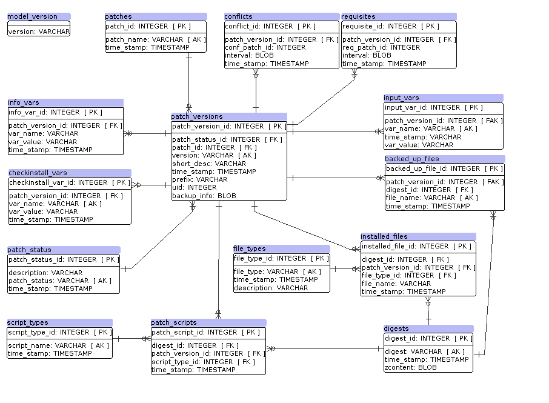

.. highlight:: none

.. _clame-database:

SQLite database model
*********************

This chapter describes in detail the database model that supports clame. It is
just a SQLlite database with enabled integrity reference.

Static tables
=============

Static tables contain rows which are loaded when database is created, and are
no subject to change, except on new releases.

model_version
-------------

.. code-block:: sql

    CREATE TABLE model_version
    (
        version     TEXT    NOT NULL
    );

Keep the current version of database model.

patch_status
------------

.. code-block:: sql

    CREATE TABLE patch_status
    (
        patch_status_id     INTEGER                             NOT NULL
                            CONSTRAINT patch_status_pk
                                PRIMARY KEY ASC AUTOINCREMENT,
        patch_status        TEXT                                NOT NULL
                            CONSTRAINT patch_status_uk
                                UNIQUE,
        time_stamp          TEXT    DEFAULT CURRENT_TIMESTAMP   NOT NULL,
        description         TEXT                                    NULL
    );

The possibles patch status. Currently, clame supports:

=============================== ==============================================
STATUS                          DESCRIPTION
=============================== ==============================================
ERROR_BACKUP                    Error doing backup
ERROR_POSTINSTALL               Postinstall phase ended with error
ERROR_POSTREMOVE                Postremove phase ended with error
ERROR_PREINSTALL                Preinstall phase ended with error
ERROR_PREREMOVE                 Preremove phase ended with error
ERROR_REGISTER_CONFLICTS        Error registering conflicts
ERROR_REGISTER_INFO_VARS        Error registering info vars
ERROR_REGISTER_INPUT_VARS       Error registering input vars
ERROR_REGISTER_INSTALL_SCRIPTS  Error registering install scripts
ERROR_REGISTER_INSTALLED_FILES  Error registering installed files
ERROR_REGISTER_REQUISITES       Error register requisites
ERROR_RESTORE                   Restore phase ended with error
ERROR_SCHEMA                    Error installing schema files
INSTALLED                       Patch successfully installed
REGISTER_CONFLICTS              Registering conflicts
REGISTER_INFO_VARS              Registering info vars
REGISTER_INPUT_VARS             Registering input vars
REGISTER_INSTALL_SCRIPTS        Registering install scripts
REGISTER_INSTALLED_FILES        Registering installed files
REGISTER_REQUISITES             Registering requisites
RUN_BACKUP                      Executing backup phase
RUN_POSTINSTALL                 Executing postinstall phase
RUN_POSTREMOVE                  Executing postremove phase
RUN_PREINSTALL                  Executing preinstall phase
RUN_PREREMOVE                   Executing preremove phase
RUN_RESTORE                     Executing restore phase
RUN_SCHEMA                      Instaling schema files and directories
=============================== ==============================================

file_types
----------

.. code-block:: sql

    CREATE TABLE file_types
    (
        file_type_id    INTEGER                             NOT NULL
                        CONSTRAINT file_types_pk
                            PRIMARY KEY ASC AUTOINCREMENT,
        file_type       TEXT                                NOT NULL
                        CONSTRAINT file_types_uk
                            UNIQUE,
        time_stamp      TEXT    DEFAULT CURRENT_TIMESTAMP   NOT NULL,
        description     TEXT                                    NULL
    );

Keep the several file types supported by clame:

================ =
FILE_TYPES
================ =
Directory
Regular file
Symbolic link
Pipe
================ =

script_types
------------

.. code-block:: sql

    CREATE TABLE script_types
    (
        script_type_id      INTEGER                             NOT NULL
                            CONSTRAINT script_types_pk
                                PRIMARY KEY ASC AUTOINCREMENT,
        script_name         TEXT                                NOT NULL
                            CONSTRAINT script_types_uk
                                UNIQUE,
        time_stamp          TEXT    DEFAULT CURRENT_TIMESTAMP   NOT NULL
    );
    

This table keep the list of supported scripts clame supports to install or
uninstall patches.

============= =
SCRIPT_NAME
============= =
checkinstall
preinstall
postinstall
preremove
postremove
============= =

Dynamic tables
==============
Dynamic tables are live entities. They keep the list of installed patches,
files, etc.

patches
-------

.. code-block:: sql

    CREATE TABLE patches
    (
        patch_id        INTEGER                             NOT NULL
                        CONSTRAINT patches_pk
                            PRIMARY KEY ASC AUTOINCREMENT,
        patch_name      TEXT                                NOT NULL
                        CONSTRAINT patches_uk
                            UNIQUE,
        time_stamp      TEXT    DEFAULT CURRENT_TIMESTAMP   NOT NULL
    );

The ``patches`` table keeps a row per patch name. Wether you have one o three
*foo* patch versions, this table only keeps a row.

patch_versions
--------------

.. code-block:: sql

    CREATE TABLE patch_versions
    (
        patch_version_id    INTEGER                             NOT NULL
                            CONSTRAINT patches_pk
                                PRIMARY KEY ASC AUTOINCREMENT,
        patch_id            INTEGER                             NOT NULL
                            CONSTRAINT patch_version_patches_fk
                                REFERENCES patches
                                ON DELETE CASCADE,
        version             TEXT                                NOT NULL,
        patch_status_id     INTEGER
                            CONSTRAINT patch_version_status_fk
                                REFERENCES patch_status,
        short_desc          TEXT                                NOT NULL,
        time_stamp          TEXT    DEFAULT CURRENT_TIMESTAMP   NOT NULL,
        prefix              TEXT                                NOT NULL,
        uid                 INTEGER                             NOT NULL,
        backup_info         BLOB                                    NULL,
                            CONSTRAINT patch_versions_uk
                                UNIQUE(patch_id, version)
    );

The ``patch_versions`` table is the core of the database model. For each installed
patch, clame keeps a row here. Every patch has a version, remember (but it
might be zero if not specified). 

The ``patch_id`` column point out to previous ``patches`` table, and
``patch_status_id`` keeps the current patch status. ``prefix`` keeps the
``PREFIX`` under patch is installed (it may be ``/``, the default). The ``uid``
column register the effective uid of the user that installed the patch. It is
neccesary to be able to ensure you uninstall later the patch with the same user.

Special mention requires ``backup_info``. It is a non mandatory column, and
only is filled if the patch needs to save information about previous filesystem
status (overwritten files, old directories, and so on). If not null, it
contains is a compressed marshaled ruby object.

info_vars
---------

.. code-block:: sql

    CREATE TABLE info_vars
    (
        info_var_id         INTEGER                             NOT NULL
                            CONSTRAINT info_vars_pk
                                PRIMARY KEY ASC AUTOINCREMENT,
        patch_version_id    INTEGER                             NOT NULL
                            CONSTRAINT info_vars_patch_versions
                                REFERENCES patch_versions
                                ON DELETE CASCADE,
        var_name            TEXT                                NOT NULL,
        var_value           TEXT                                NOT NULL,
        time_stamp          TEXT    DEFAULT CURRENT_TIMESTAMP   NOT NULL
    );

    CREATE INDEX info_vars_patch_versions
        ON info_vars(patch_version_id);

The ``info_vars`` table keeps the list of info variables per patch. Clame
retrieve the pairs varname and varvalue from this table when needed.

requisites
----------

.. code-block:: sql

    CREATE TABLE requisites
    (
        requisite_id        INTEGER                             NOT NULL
                            CONSTRAINT requisites_pk
                                PRIMARY KEY ASC AUTOINCREMENT,
        patch_version_id    INTEGER                             NOT NULL
                            CONSTRAINT requisites_patch_versions
                                REFERENCES patch_versions
                                ON DELETE CASCADE,
        req_patch_id        INTEGER                             NOT NULL
                            CONSTRAINT requisites_patches
                                REFERENCES patches
                                ON DELETE CASCADE,
        interval            BLOB                                NOT NULL,
        time_stamp          TEXT    DEFAULT CURRENT_TIMESTAMP   NOT NULL
    );

    CREATE INDEX requisites_req_patch_id_idx
        ON requisites(req_patch_id);

The ``requisites`` table keeps the patches required per patch, by inspecting
the ``depend`` file.

The ``interval`` column is a marshaled ruby compressed object that contains the
full information about a specific dependency. Therefore, ``req_patch_id``
column is redundant, as it is included in ``interval``. But it is neccesary to
bring good performance when clame needs to search the requisites of a specific
patch.

conflicts
---------

.. code-block:: sql

    CREATE TABLE conflicts
    (
        conflict_id         INTEGER                             NOT NULL
                            CONSTRAINT conflicts_pk
                                PRIMARY KEY ASC AUTOINCREMENT,
        patch_version_id    INTEGER                             NOT NULL
                            CONSTRAINT conflicts_patch_versions
                                REFERENCES patch_versions
                                ON DELETE CASCADE,
        conf_patch_id       INTEGER                             NOT NULL
                            CONSTRAINT conflicts_patches
                                REFERENCES patches
                                ON DELETE CASCADE,
        interval            BLOB                                NOT NULL,
        time_stamp          TEXT    DEFAULT CURRENT_TIMESTAMP   NOT NULL
    );

    CREATE INDEX conflicts_conf_patch_id_idx
        ON conflicts(conf_patch_id);

Pretty similar to `requisites`_. It keeps the patches which conflicts with a
specific one, by inspecting the ``depend`` file.

As before, hhe ``interval`` column is a marshaled ruby compressed object that
contains the full information about a specific conflict. Therefore,
``conf_patch_id`` column is redundant, as it is included in ``interval``. But
it is neccesary to bring good performance when clame needs to search the
conflicts of a specific patch.

input_vars
----------

.. code-block:: sql

    CREATE TABLE input_vars
    (
        input_var_id        INTEGER                             NOT NULL
                            CONSTRAINT input_vars_pk
                                PRIMARY KEY ASC AUTOINCREMENT,
        patch_version_id    INTEGER                             NOT NULL
                            CONSTRAINT input_vars_patch_versions
                                REFERENCES patch_versions
                                ON DELETE CASCADE,
        var_name            TEXT                                NOT NULL,
        time_stamp          TEXT    DEFAULT CURRENT_TIMESTAMP   NOT NULL,
        var_value           TEXT                                    NULL,
                            CONSTRAINT input_vars_uk
                                UNIQUE(patch_version_id, var_name)
    );

The ``input_vars`` table is pretty similar to `info_vars`_ table, but keeping input
variables instead of info variables. 

checkinstall_vars
-----------------

.. code-block:: sql

    CREATE TABLE checkinstall_vars
    (
        checkinstall_var_id     INTEGER                             NOT NULL
                                CONSTRAINT checkinstall_vars_pk
                                    PRIMARY KEY ASC AUTOINCREMENT,
        patch_version_id        INTEGER                             NOT NULL
                                CONSTRAINT checkinstall_vars_patch_version
                                    REFERENCES patch_versions
                                    ON DELETE CASCADE,
        var_name                TEXT                                NOT NULL,
        var_value               TEXT                                NOT NULL,
        time_stamp              TEXT    DEFAULT CURRENT_TIMESTAMP   NOT NULL,
                                CONSTRAINT checkinstall_vars_uk
                                UNIQUE(patch_version_id, var_name)
    );

The ``checkinstall_vars`` table is also pretty similar to `info_vars`_ table.
It keeps the list of variables names and values registered by ``checkinstall``
script.

digests
-------

.. code-block:: sql

    CREATE TABLE digests
    (
        digest_id       INTEGER                             NOT NULL
                        CONSTRAINT digests_pk
                            PRIMARY KEY ASC AUTOINCREMENT,
        digest          TEXT                                NOT NULL
                        CONSTRAINT digest_uk
                            UNIQUE,
        time_stamp      TEXT    DEFAULT CURRENT_TIMESTAMP   NOT NULL,
        zcontent        BLOB                                    NULL
    );

The ``digests`` is a special table that keeps a list of the whole
regular files installed by clame. Each regular file is identified by a SHA256
hash, and it is what is saved in ``digest`` column. That list includes the
scripts required to install or uninstall a specific patch (``postinstall``,
``postremove`` and so on), but in this case, the compressed script content is
saved in ``zcontent`` column. Therefore, the ``zcontent`` is only filled when
the file references to a patch script, not when references to a file specified
in schema (that is the reason why ``zcontent`` column is not mandatory).

patch_scripts
-------------

.. code-block:: sql

    CREATE TABLE patch_scripts
    (
        patch_script_id     INTEGER                             NOT NULL
                            CONSTRAINT patch_script_pk
                                PRIMARY KEY ASC AUTOINCREMENT,
        patch_version_id    INTEGER                             NOT NULL
                            CONSTRAINT patch_scripts_patch_versions_fk
                                REFERENCES patch_versions
                                ON DELETE CASCADE,
        script_type_id      INTEGER                             NOT NULL
                            CONSTRAINT patch_scripts_script_type_fk
                                REFERENCES script_types,
        digest_id           INTEGER                             NOT NULL
                            CONSTRAINT patch_scripts_digests_fk
                                REFERENCES digests,
        time_stamp          TEXT    DEFAULT CURRENT_TIMESTAMP   NOT NULL,
                            CONSTRAINT patch_script_uk
                                UNIQUE(patch_version_id, script_type_id)
    );

    CREATE INDEX ps_di_idx ON patch_scripts(digest_id);
    CREATE INDEX ps_pv_idx ON patch_scripts(patch_version_id);

The ``patch_scripts`` table contains the list of scripts that a specified patch
uses. The script content is not saved in this table, but in `digests`_ one.
Notice that script type (``postinstall``, ``postremove``, and so on) are keeped
in ``script_type_id`` column.

installed_files
---------------

.. code-block:: sql

    CREATE TABLE installed_files
    (
        installed_file_id   INTEGER                             NOT NULL
                            CONSTRAINT installed_files_pk
                                PRIMARY KEY ASC AUTOINCREMENT,
        patch_version_id    INTEGER                             NOT NULL
                            CONSTRAINT installed_files_patch_versions
                                REFERENCES patch_versions
                                ON DELETE CASCADE,
        file_name           TEXT                                NOT NULL,
        file_type_id        INTEGER                             NOT NULL
                            CONSTRAINT installed_files_file_types
                                REFERENCES file_types,
        time_stamp          TEXT    DEFAULT CURRENT_TIMESTAMP   NOT NULL,
        digest_id           INTEGER                                 NULL
                            CONSTRAINT installed_files_digest
                                REFERENCES digests,
                            CONSTRAINT installed_files_uk
                                UNIQUE(patch_version_id, file_name)
    );
    CREATE INDEX if_fn_idx ON installed_files(file_name);
    CREATE INDEX if_di_idx ON installed_files(digest_id);

The ``installed_files`` is one the most important clame entities. For each
installed patch, it keeps the list of files or directories referenced in the
schema. The information includes:

* The absolute path installation (``file_name`` column)
* The file type (directory, regular file, symbolic link, etc)
* If is a regular file, the ``digest_id`` points out to its SHA256 digest
  (thus, ``digest_id`` is not mandatory and maybe null)

backed_up_files
---------------

.. code-block:: sql

    CREATE TABLE backed_up_files
    (
        backed_up_file_id   INTEGER                             NOT NULL
                            CONSTRAINT backed_up_files_pk
                                PRIMARY KEY ASC AUTOINCREMENT,
        patch_version_id    INTEGER                             NOT NULL
                            CONSTRAINT backup_up_files_patch_versions
                                REFERENCES patch_versions
                                ON DELETE CASCADE,
        file_name           TEXT                                NOT NULL,
        digest_id           INTEGER                             NOT NULL
                            CONSTRAINT backup_up_files_digest
                                REFERENCES digests,
        time_stamp          TEXT    DEFAULT CURRENT_TIMESTAMP   NOT NULL,
                            CONSTRAINT installed_files_uk
                                UNIQUE(patch_version_id, file_name)
    );

    CREATE INDEX buf_fn_idx
        ON backed_up_files(file_name);
    CREATE INDEX buf_di_idx
        ON backed_up_files(digest_id);

The ``backed_up_files`` table is pretty similar to `installed_files`_ table.
For each installed patch, it keeps the absolute path and SHA256 digest of
regular files that might be required when the patch is uninstalled. The files
content is not saved here, neither in this SQLite database, but in the
directory pointed out by ``backup_dir_install`` configuration setting.

Database model diagram
======================

